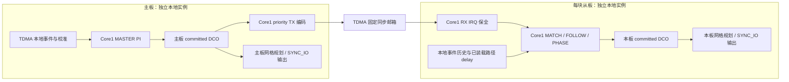

# VDC 内部主域架构

Status: Active
Domain: VDC
Canonical: `docs/vdc/VDC_DOMAIN_ARCHITECTURE.md`
Related: `docs/vdc/VDC_RUNTIME_CONSTRAINTS.md`, `docs/vdc/VDC_DOMAIN_TODO.md`, `docs/vdc/VDC_TASK_PROGRESS.md`, `docs/tdma/TDMA_DOMAIN_ARCHITECTURE.md`, `docs/sync/SYNC_IO_ARCHITECTURE.md`, `docs/arch/HAOFV_ARCHITECTURE.md`
Last updated: 2026-09-19

## 文档接口与范围

VDC 维护本地时间到输出时间的映射、DPLL 控制及其发布视图。当前实时主线是 **主板发布事件时间戳，从板在 Core1 匹配对应事件并自行校正 DCO，SYNC_IO 用 PIO/DMA 执行输出**。VDC 不拥有 TDMA 运输、Calibration 测量、底层 IO 资源或 Trigger 业务预约。

| 文件 | 职责 |
|---|---|
| 本文 | 当前模块、数据流、owner、状态含义与实现边界；保留已登记契约入口。 |
| [运行接口细则](VDC_RUNTIME_CONSTRAINTS.md) | 编码、身份、生命周期、预算、兼容协议及版本化记录的详细约束。 |
| [TODO](VDC_DOMAIN_TODO.md) | 未完成/已完成任务、依赖和退出门禁。 |
| [Task Progress](VDC_TASK_PROGRESS.md) | 实测、失败、源码指纹和验收证据；历史由其归档索引查找。 |

“已有实现”表示代码路径存在，不等于所有配置或产品发布已验收。本文不把单轮精度数字固化为架构保证，也不以枚举存在推定状态迁移完整。

本文面向总体架构评审：先看能力边界、数据流和 owner，再看时基、控制、输出与发布。代码落点用于核验设计是否已经接线；编码和版本细节集中在配套细则。

## 当前实现与完成边界

| 能力 | 代码现状 | 保留边界 |
|---|---|---|
| 主板 PI 与参考发布 | Domain 的 MASTER evidence 路径执行 FLL/PI；priority TX 按事件时 committed DCO 编码。 | 有效输入、PI 更新和成功发布分别计量。 |
| 从板本地跟踪 | typed RX → exact-sequence MATCH → 频率/可选相位控制 → Domain DCO 提交。 | 接收、匹配、采用、最终模型发布和 GPIO 生效不是同一个事件。 |
| 共同网格输出 | 整数反解、独立 output delay、有限后缀规划和 SYNC_IO PIO/DMA 输出已接通。 | 诊断持续输出不自动授权正式产品 RUN；前缀、供给期限及物理精度分别验证。 |
| 运行配置与持久化 | PI/角色、早期基线、输出 delay/时间窗口有配置接口；关键调试模式经 STOP 安装。 | Core1 仅用 RAM 快照；Flash 不保存运行积分、锁状态或会话。 |
| 内部与外部观测 | 有界原生/汇总/GUARD SRAM 记录，STOP 后导出；主机可选示波器联合采集。 | 内部模型不等于 GPIO；稀疏波形不证明未采样区间。 |
| 一致发布 | committed DCO 与完整 runtime 分别加 guard；publication revision 独立于 evidence 序号，空转维护 age/health，ready 变化发布派生质量，外参非零采用发布 clock/DCO。 | 局部发布修复见进度 026、027；正式有效性、失联与恢复仍待闭合。 |
| 正式质量与恢复 | Domain 有 lock、quality tier、health、age 和恢复状态接口。 | 自动失联降级、HOLDOVER/恢复和完整产品门禁尚未闭合；详见 TODO。 |

## 数据流与代码落点

系统分为控制面、实时面和观测面：Core0 在许可边界安装配置；Core1 完成事件匹配、DCO 控制与未来输出准备；硬件执行边沿。管理镜像、原生记录及外部示波器用于读取和验证，不成为逐事件闭环的等待条件。

每板分别拥有 Core0 配置/intent、Core1 manager 和快照发布链路，图中省略这些重复结构。主板与从板不共享 DCO 实例；TDMA 传递冻结事件时间戳，各板 PIO/DMA 独立执行边沿，Core0/RefMem 只读取本板管理快照。

| 模块 | 当前实现职责 |
|---|---|
| `components/vdc_domain/src/vdc_domain.c` | 纯状态/算术、evidence gate、MASTER servo、DCO 映射与本地增量提交、兼容质量字段。 |
| `components/vdc_dpll_manager/src/vdc_dpll_manager.c` | 配置意图、TDMA evidence 分步处理、Core1 service 编排、完整快照与 Core0 管理发布。 |
| `vdc_priority_tx.inc`、`vdc_priority_rx.inc`、`vdc_priority_codec.c` | 固定 typed 编码、TDMA provider 与直接 RX 交接；普通 RefMem parser 不消费此类型。 |
| `vdc_priority_match.inc`、`vdc_priority_follow.inc`、`vdc_priority_phase.inc` | 精确事件匹配、区间频差估计、本地调频/相位采用及回执。 |
| `vdc_model_feedback.inc` | 真实 committed DCO、model token、`valid_from_raw` 和稳定读取。 |
| `vdc_run_output.inc`、`vdc_output_edge_plan.h` | 输出目标反解、延迟和未来后缀；调用 SYNC_IO capability，不直接操作 PIO。 |
| `vdc_priority_trace*.inc`、`vdc_priority_guard.inc` | 维护记录、分段汇总、目标封存和诊断监督。 |
| `application/src/app.c` | 静态相位准入、完整/规划/缓存输出服务、执行时间记账。 |

上表未带目录的文件位于 `components/vdc_dpll_manager/src/` 或 `inc/`。`VdcSyncAO`、`VdcQualityGateFB`、`VdcVector` 是 HAOFV 职责名称/演进划分，不能据此认定当前已拆成同名独立模块；当前接线以上述代码为准。后续模块拆分应保持现有 owner 和有界交接，不引入实时任务间等待。

## HAOFV owner 边界

| Owner | 拥有与交接 |
|---|---|
| STATE_MACHINE / SYNC_IO | 资源 claim、PIO/SM/DMA/FIFO/GPIO/IRQ 生命周期及实际输出；VDC 只请求准备、提交和取消。 |
| TDMA Foundation | 运行配置、固定 process image、载荷圈序号、CRC、原始事件历史及同步记录装卸；不计算 DCO。 |
| Calibration | 有向 delay/bias、路径矩阵、代际和 freshness；VDC 只加载/索引，不临时沿环累加。 |
| Core1 manager / SyncDpllFB | 运行态控制和 DCO 唯一写者、模式复验及发布；RX IRQ 仅做有界保全/解码，不运行完整 servo。 |
| Core0 控制面 | 初始化/STOP 配置、单槽 intent、显式 Flash 保存及管理读回；活动会话的实时变更交 Core1。 |
| RefMem / Trigger / 主机 | 消费稳定事实或提交请求；不能回写 PI、DCO、lock、accepted count。 |

唯一 writer 按生命周期和字段定义：活动 feedback session 的 ready 变更为 Core0 intent → Core1 应用；无 session 的初始化/维护路径仍可能由 Core0 更新 Domain。不能把运行态规则扩大为所有阶段均由 Core1 写全部字段。

实时路径保持有界、无动态分配、无 RTOS 搬运、无 SCPI/USB/SD 等待。Flash 写入仅 Core0，按既有维护流程等待 Core1 park/ACK。硬件输出和 DCO 更新都不改写底层原始计数器。

## 时间坐标与模型

| 坐标/模型 | 含义与事实源 |
|---|---|
| TIMER1 raw ticks | `vdc_timestamp_clock_*` 提供的原始计数；tick frequency/resolution 由实际初始化与板级配置决定。 |
| 本地 ns | `vdc_timer1_coordinate.h` 的 TIMER1-origin 纳秒坐标；当前 manager 的 `now_ns`、DCO 本地锚与 RUN 反解使用此域。 |
| DCO output ns | `vdc_domain_dco_local_to_output_ns()` 对同一不可变 DCO 的投影，包含 base、phase 和 rate。 |
| legacy `clock` | Domain 原 evidence/servo 的时钟估计和兼容诊断模型；从板本地 DCO 提交后不能拿它替代实际输出模型。 |
| committed model | 完整实际 DCO 加 session、role/clock 身份、token、`valid_from_raw`；事件投影与输出使用它。 |

`base_local_tick64` 在当前 manager 中实际存本地 **ns**，字段名不意味着 raw tick；转换必须显式。TIMER0 保持 SDK uptime、alarm、通信超时和 Flash lockout 的系统语义。旧 TIMER0/TIMER1 bridge、求交缓存和记录重放属于兼容路径，当前 typed TX/MATCH 与 RUN 使用 TIMER1 直接坐标。

时间戳记录完整区间，不能用中点隐藏测量宽度。硬件事件 enable bracket、整数取整、路径/bias 和 GPIO 检测误差各自保留；计数分辨率不等于物理同步精度。clock epoch/run、运行 generation、事件 sequence 和承载圈 sequence 各有含义，不能相互替代。

## 特等席参考与本地控制

### 运输与匹配

1. STOP 安装 feedback session、SYNC/MATCH/FOLLOW 请求及上下文。请求换代、配置应用和 owner ACK 分开核对。
2. 主板 `vdc_priority_tx_core1()` 从 TDMA 事件取得原始区间，按事件时有效的 committed DCO 投影并编码；同事件成功编码后字节冻结，不随之后模型回算。
3. TDMA 复验固定邮箱身份/CRC，经既有双缓冲提交；旧 DMA bank 退休后才可复用。provider 候选、软件提交、硬件选中和线上送达分别计量。
4. 从板 Core1 RX IRQ 在普通队列之前保全/解码，记录 source、运行代际、完整事件序号和区间。它不等待 Core0/RefMem 分片，也不与普通 FIFO consumer 争用 tail。
5. `vdc_priority_match_core1()` 按完整事件序号定位本地历史槽，复验 observer/ARM、RX epoch、模型、年龄和路径，再形成单次服务的内部票据。STOP 诊断快照不能重新授予控制权。

codec body 由 `VDC_PRIORITY_CODEC_BODY_SIZE` 及 `TDMA_PROCESS_IMAGE_PRIORITY_SYNC_*` 定义；header 保留 source/target 和事件低位，body 带完整 generation、event sequence、output-ns 下界、宽度和 flags。body CRC helper 不替代外层完整邮箱 CRC。

当前 MATCH 核实已装载 reverse-DATA 矩阵后转置查询，暂用作 provisional forward-CS delay；未包含的方向非对称、中继驻留及端点 bias 仍需独立校准。输出侧 `OUTPut:DELay` 不补写该路径事实。

令本地投影为 L，远端时间戳加路径 delay 为 E，则残差为 `[L.lo − E.hi, L.hi − E.lo]`。区间加减检查溢出，使用后复验生命周期和模型；无效、未齐或被覆盖事件跳过，不补造样本。

### 频率与相位

| 路径 | 当前控制算法 | 应用边界 |
|---|---|---|
| MASTER Domain PI | 有效 phase 差估频、按周期解绕、最小间隔及 frequency slew；Ki 累积 rate、限幅/anti-windup，Kp 做受限 phase 修正。 | `vdc_domain_update_clock_from_evidence()`；首样本可受限 step，后续 slew，普通 follower evidence 只诊断。 |
| typed follower rate | 同运行绑定下，以两个事件的本地/期望区间估计频差；本地共同锚差分与绝对端点差求交，按有界档位复评，保留跨零/保持。 | `priority_follow_apply_core1()` 最终复验后调用 `vdc_domain_apply_local_follow_rate_delta()`；在当前时间连续重基，推进真实 DCO 序号。 |
| 可选 typed phase | 显式开启后，用完整残差区间的限幅中点估计反向平移；零估计保持，非零 rate 提案优先。 | `vdc_domain_apply_local_follow_phase_delta()` 只平移 DCO base；完整 committed-model 回执确认后才延续同 rate epoch 的累计平移账本。 |

频率变化、未知模型变化、回执不一致和 STOP 取消相应基线/未决工作；不得仅凭 rate 相同推定精确平移关系。原始 MATCH 端点保留，不以归一化坐标改写观测。

相位平移是显式调试获取能力，负平移不保证跨更新时间的共同时间单调性；不能据此授予产品 RUN。当前相位路径在 Domain/DCO 已为 `LOCKED` 时拒绝该调试 step。控制采用、模型发布、后续输出采纳和物理锁相分别验收。

### 角色与兼容路径

`MASTER/FOLLOWER` 仍是 Domain 控制 profile；FOLLOWER 的普通 local evidence 不进入 MASTER PI。**显式 typed 本地跟踪**是独立控制路径，并非隐式回退：开启后旁路旧 RefMem follower command 消费，与 boundary PROBE/AUTO、旧 LOCAL_FOLLOW 互斥。

`VDC-REFERENCE-01` 的 Core0 分片参考/接收 ACK、`VDC-BOUNDARY-01` 的逐从命令及绝对定时 command 均保留兼容实现。ACK 只证明对应接收或命令采用语义，不是 typed matcher 自动产生的锁相凭证，也不阻塞 NO1 PI 或 TDMA 发车。

任意角色组合和多主机配置仍须逐配置验收。本地 oscillator discipline 已有 Domain profile/request/freeze 接口，但尚未接入应用侧实物 actuator；不能描述为已实现晶振驯服。

## 输出与静态调度

`vdc_domain_dco_output_to_local_ns()` 以整数算术求合法输出目标的最早本地时间；`vdc_output_edge_plan` 选严格未来的共同 anchor/period 网格，尊重首个未提交 ordinal。独立有符号 output delay 在反解后的本地时间轴只加一次，过期网格跳过，禁止突发补发。

Core0 在 TDMA STOP 排他边界 PREPARE，锁存 session、delay、周期、时间窗口和静态表配置，SYNC_IO 预留能力并保持安全低态。START 和全部身份满足后，Core1 分批规划有限后缀、复验并提交，PIO 执行编码边沿；模型更新只丢弃未提交后缀，不改写已提交前缀。

| 服务入口 | 调度及工作范围 |
|---|---|
| 完整 TDMA 后输出服务 | `vdc_run_output_service_core1()`；处理生命周期、规划与提交。 |
| 独立规划候选 | 完整 TDMA 服务无法容纳时，在同一相位按 `PROJECT_CORE1_RUN_OUTPUT_PLAN_WCET_CYCLES` 准入 `vdc_run_output_service_planned_core1()`。 |
| 缓存交接候选 | 规划预算也无法容纳时，按 `PROJECT_CORE1_RUN_OUTPUT_HANDOFF_WCET_CYCLES` 准入 cached-only；仅提交有效已有后缀，不生成首块。 |
| DPLL 服务 | `sync_dpll_fb_service()` 由静态 DPLL phase 调用；窗口/WCET/入口余量由 `PROJECT_CORE1_PHASE_DPLL_*`、`PROJECT_CORE1_DPLL_ENTRY_MARGIN_CYCLES` 定义。 |

入口互斥且不借后续相位/GUARD；IRQ 开放窗口和执行账由 dispatcher 管理。预算是准入配置，是否达到 WCET 需目标板测量，局部短服务通过不代表完整静态表通过。函数放 SRAM 也不证明整个调用链脱离 XIP。

持续输出以 duration=0 显式选择，不设整次到期时刻，仍需有限块补给、模型/时钟复验与故障退休。固定脉宽模式在 STOP 预装 PIO ISR，高宽固定、运行提交低段；可变高宽保留独立编码。DMA 源退休、硬件库存和 GPIO 完成各自独立，客户端所有权采用一次非阻塞尝试，暂忙留待后续 service。

## 状态、质量与失败恢复

| 事实 | 当前含义 |
|---|---|
| `vdc_domain_lock_state_t` | 代码包含 OFF、CHECKING、INITIAL_SYNC、FREQ_LOCK、PHASE_LOCK、LOCKED、HOLDOVER、RELOCKING、FAULT；并非所有失效迁移都已接通。 |
| Domain `LOCKED` | 普通 evidence 路径满足样本/残差门限与连续计数后的控制状态；typed DCO 采用不自动推进该状态。 |
| `vdc_domain_lock_quality_t` | NONE / COARSE_10US / DEBUG_1US / FINE_100NS；门限见 `vdc_domain.h`，不等于 GPIO 实测等级。 |
| `VDC_DOMAIN_HEALTH_HEALTHY` | `vdc_domain_refresh_quality_state()` 要求 LOCKED、gate 通过、fine tier 及有效且未超龄的 freshness。 |
| `rms_offset_ns` / `jitter_rms_ns` | 当前是历史平滑统计字段，不能当作严格统计 RMS 的精度证明。 |
| 产品 formal promotion | `FORMAL_LOCKED`/`COARSE_LOCKED` 是架构目标名称，当前没有同名 Domain 枚举或完整独立 promotion 实现。 |

普通样本拒绝与当前绑定失效分开：单个坏/旧样本不冒充新输入，也不自动证明当前时间基已换代。真正 STOP、角色/session/observer/clock 换代撤销授权；raw counter 不回写。调试 continuation 保留原 gate 且不执行 PI/DCO，不授予正式质量。

`distributed_refmem.c` 在 debug continuation 开启时不发布 `REFMEM_VECTOR_FLAG_LOCKED`。按 [EXE-SAFE-01](../check/DOCS_EXECUTION_CONSTRAINTS.md#exe-safe-01可恢复拒绝的记录与有界继续)，调试态 DPLL 失锁或局部 WCET/deadline 超限本身不隔离收发仍健康的 TDMA 节点；异常须记录，节点级隔离只适用于 TDMA 或不可恢复硬件资源故障。

`sync_dpll_fb_service()` 在 step 的提前返回前维护质量年龄：`vdc_domain_age_quality()` 只更新 age/health，已有 HOLDOVER 同步其年龄，不推进服务/证据计数或自动迁移控制状态。无参考时间或读钟失败跳过；工作 Domain 与已发布视图分别按各自参考时间和状态老化，不提前公开未 finalize 的证据。ready 变化刷新派生质量，并在已有 runtime 快照时发布。缺参考自动 HOLDOVER、误差边界增长、恢复重锁及正式有效发布仍属于 `VDC-SNAPSHOT-001`、`VDC-HOLD-001`、`VDC-RECOVERY-001` 后续门禁。

typed FOLLOW 的来源新鲜度独立于正式 quality。`vdc_dpll_manager_get_priority_follow_health()` 返回 Core1 单写者的原子快照：FOLLOW 身份与年龄复验通过后，只消费本拍新的 MATCH 事件；每拍按 TIMER1 `raw_lo/raw_hi` 维护年龄，期限复用 `VDC_PRIORITY_FOLLOW_MAX_AGE_MS`，不依赖可选 TRACE/GUARD。FRESH 只表示最后合格来源事件仍年轻，不表示本拍执行成功或锁相；重复事件、BUSY、旧代和拒绝不续期。STALE 时原控制路径保持 DCO、清除待执行项和基线，新事件恢复先重新建基线；STOP/绑定变化退休，诊断留存。读钟失败和反向时间不视为新鲜，`recoveries` 包括同一年轻事件在读钟恢复后的 STALE→FRESH 转换。该快照不修改 Domain 的 accepted、quality、DPLL 或 DCO 序号，也不自动进入 RefMem 正式质量字段。

参考停更诊断由 `vdc_priority_tx_gap.inc` 承接：Core0 在 STOP 边界安装绑定当前 SYNC generation/session 的一次计划，Core1 使用既有 TIMER1 观测按半开窗口暂停新 offer，截止后仅允许新产生的 source event 恢复。暂停仍复验生命周期，STOP/绑定变化取消；默认关闭、不写 Flash、不跨代重放。返回 EMPTY 保留 TDMA 的旧 DMA 邮箱，故验证的是旧参考重复与新鲜度过期，不是物理断链。诊断状态独立发布，不修改正式 quality 或 DCO。

## 快照与管理发布

| 发布层 | 当前语义 |
|---|---|
| committed DCO | 活动 session 的 guard 包围整个 Core1 owner step，末尾 `model_feedback_end_core1()` 发布实际 DCO；变化建立 token/`valid_from_raw`。读者单次稳定检查，奇数或变化即失败。 |
| 完整 runtime snapshot | service/提交及 ready 变化发布完整视图；空转仅以同一 guard 刷新已发布的 age/health/holdover age，不调用带 capture 副作用的完整 publisher，也不替换 DCO/证据字段。 |
| 外参模型采用 | `reference_discipline_service_core1()` 非零基线采用成功后，以 runtime guard 只发布 clock/DCO；保留上次已完成的 DPLL/quality，未完成的 servo 证据仍等 finalize。不因重复、零步进或拒绝推进模型发布。 |
| Core0 / RefMem mirror | 按成功复制快照的 `publication_revision` 去重；wire evidence 序号保留原语义。 |

小模型发布解决事件投影的提交/可见性边界，不代替质量老化。`clock.valid`、model token、publication revision、DCO update seq 都不是 freshness 或正式共同时间资格。

## 配置、观测与诊断

控制面经 SCPI/配置 intent 在 owner 边界生效；SYNC/MATCH/FOLLOW/PHASE、输出 delay/时间窗口等遵守各自 STOP 门禁。PI 调参可经单槽 mailbox 在 service 边界采用，不能把所有配置笼统当作 RUN 可写。requested/applied generation 和失败回退须可对账；仅显式 store 写 Flash，旧记录按各版本 CRC 迁移。

详细 trace、汇总、GUARD 互斥复用原维护 SRAM 池，布局和容量见 `vdc_priority_trace.h`。详细模式满后只证明前缀；汇总保留成功极值、拒绝/缺口、服务/成功间隔、计数回退及饱和，空段不表示零残差。

GUARD 由 Core1 按检查点判参考和输出健康，目标完成先封存末段再发布 PASS，保持输出到主机统一 STOP；失败意图由 Core0 复验原配置/session 后请求本板退休。PASS 不等于 STOP 回执，也不是独立硬件 watchdog，不能保证全板同步停机。封存后的尾段输出退休另审。

运行记录不走串口/SD 实时导出，全部 STOP 后读取、CRC 解码和 RELEASE；可选示波器只在主机观测实际 GPIO。内部/外部、同轮/同事件、稀疏窗口/连续覆盖分别判定，外部结果不回写实时控制。

## 跨域契约入口

登记表仍为 `docs/check/DOCS_REGISTRY.md`；本次按实现梳理及拆分细则，不改变契约 ID、版本或登记状态。以下入口与配套细则共同组成原契约，状态为 pending 的条款不因已有局部实现自动转 active。

### VDC-DPLL-01：时间戳资格

登记契约要求 DPLL 准入时间戳满足细粒度分辨率与硬实时 latch 来源；分辨率门限对应 `VDC_DOMAIN_DEFAULT_TIMESTAMP_RESOLUTION_LIMIT_NS`。代码另有 `VDC_DOMAIN_DPLL_ADMISSION_TIMESTAMP_RESOLUTION_LIMIT_NS` 的粗粒度准入，不能用其放行代替 fine 或产品资格。

登记的细粒度要求与通用 Domain admission 上限当前不相同；通用入口通过不表示 `VDC-DPLL-01` 全链路满足。此处显式记录实现边界，不修改登记门限或状态。

### VDC-PATHMATRIX-01：路径矩阵

Calibration load 建立完整 source/reference 矩阵，运行态只做索引，缺失/过期/代际或 CRC 不匹配拒绝正式使用；typed provisional delay 不提升为正式校准。

### VDC-OBSALIGN-01：相位域

跨板 observation 必须声明同硬件计数器或 generation-bound 的 local-to-common 映射；raw local phase 不能直接输入 MASTER PI 或可信 jitter。source/reference、同事件身份、delay/bias 和 mapping 缺失时仅诊断。

### VDC-PRIORITY-01：确定性同步与本地跟踪

固定 typed 编码、运行绑定、TX/RX owner、直接匹配、频率/相位采用、输出后缀、trace/GUARD 及退休边界见 [特等席细则](VDC_RUNTIME_CONSTRAINTS.md#vdc-priority-01core1-预编码同步邮箱与运行绑定)。当前 TIMER1 路线与旧桥接记录的适用范围在细则首节区分；单圈期限、GPIO 精度及正式发布单独验收。

### VDC-PUBLICATION-01：完整快照刷新

完整快照的本地偶数 guard 是刷新标记，与 DPLL evidence 序号分离；失败不消费，零值回绕有效，保留有限 ABA 假设。每 beat 至多一份 RefMem 向量，旧 wire/CRC/quality 不变；完整约束见 [发布细则](VDC_RUNTIME_CONSTRAINTS.md#vdc-publication-01完整快照刷新与证据序号分离)。

### VDC-REFERENCE-01：兼容分片参考与 ACK

STOP 后显式授权、固定分片配额、完整发布证明和逐字节 ACK 对账；收到不等于 DCO 采用，ACK 不阻塞 PI/发车。见 [参考运输细则](VDC_RUNTIME_CONSTRAINTS.md#vdc-reference-01显式参考事件时间戳运输)。

### 外部参考测量与慢速补偿

外部 10 MHz 输入先作为诊断测量源。`SYSTem:VDC:REFerence:CONFigure` 设置输入端口、边沿、标称频率、测量窗口和失联超时；`ENABle 1` 只在 STOP 阶段申请 SYNC_IO 的 PIO/DMA 资源，Core1 负责有限窗口采样，`STATus?` 返回状态、样本序号、原始计数和相对标称频偏。`DEFAult`、`RECall`、`STORe` 只处理参数，Flash 不保存使能状态。测量的 DMA 延迟尚未形成有界精度证明，也不会自动改写 DCO；基准驯服另行验收。

`sync_io_reference_service_core1()` 将采样超时作为可恢复状态：异步中止并排空旧窗口，保留 lease/generation 后重试，直到完整新窗口有效才清除 TIMEOUT。地址、token、序号或 DMA/时钟故障仍终止；取消在退休确认后释放资源。完整记录先检结构，再判 deadline，未超时才做计数求值，避免失联拉长窗口被误判为永久坏记录。

补偿由独立的 `DISCipline` 意图启用，STOP 配置且上电关闭。`vdc_reference_discipline.inc` 在 Core1 committed-model 提交边界消费新鲜硬件窗口，按会话、参考代际、角色、时钟和主板 origin epoch 去重绑定。`DISCipline:CONFigure` 配置调频斜率、滤波分母及测量准入限幅，默认值见 `PRODUCT_CONFIG_VDC_REFERENCE_DISCIPLINE_DEFAULT_*`；`DEFAult/RECall/STORe` 分别恢复默认、读取保存值及显式保存。配置仅在 STOP 且补偿未启用时修改，ARM 锁存；`CONFigure?` 读请求参数，`ACTive?` 读 Core1 锁存参数、代次和 CRC。Flash 仍经 Core0 停态维护与 FlashTransaction，旧记录仅在 RAM 迁移，上电不自动启用。Domain 将绝对参考基线与 MASTER PI 残差分开，再合成实际速率；更新时连续重基，不调整 TIMER0/TIMER1 原始计数器。失联或取消冻结最后基线，新的运行配置重建模型；从板继续跟踪 NO1 已提交时间戳。此实现不提升 formal quality，实板精度和失联恢复按 TODO 分别验收。

已绑定会话失去有效窗口时，外参补偿进入 `VDC_REFERENCE_DISCIPLINE_HOLD`，冻结最后基线、清除滤波历史；恢复后的新鲜窗口只获得正常单窗口调频预算，不累计失联期间的调整额度。此 HOLD 不等同于 Domain 的正式 HOLDOVER，也不自动提升 quality；实板超时重试、显式重启和物理断接后同会话恢复须分别留证。

### VDC-BOUNDARY-01：兼容逐从命令

Core0 准备/组装，Core1 校验身份与年龄后至多一次采用；有界重复不续期，未决不叠加，精确 ACK 与取消保留。PROBE/AUTO 与 typed 本地跟踪互斥；见 [命令细则](VDC_RUNTIME_CONSTRAINTS.md#vdc-boundary-01本地服务边界频率增量命令)。

## 验证映射

总体评审分别判断四件事：参考是否确定性到达、控制是否实际采用、引脚是否满足声明精度、共同时间能否安全发布。前一项通过不能替代后一项；当前初步闭环成果由前述已有路径承接，正式时间服务继续按 TODO 闭合。

| 范围 | 主要验证入口 / 必须证明 |
|---|---|
| Domain / codec / 匹配与控制 | `tests/python/test_vdc_*` 及对应 C host fixtures：算术端点、量纲、回绕、完整身份、模型有效期、重复/旧代、采用和失败不变性。 |
| 输出与资源 | `vdc_run_output` / `sync_io_run_output` 测试、目标 map/WCET 与实板：前缀不可改写、DMA 退休、模型换代、补给和 STOP。 |
| 发布与恢复 | Domain→manager→Core0/RefMem 链路：复制版本一致、失败不确认、无输入 age、ready 变化、HOLDOVER/恢复；未闭合项见 TODO。 |
| trace / GUARD | 版本、CRC、捕获身份、覆盖/缺口、末段封存、PASS/STOP 分离及 RELEASE；旧记录严格按旧 schema 解释。 |
| 四板专项 | internal 验控制采用与缺口；同次四路 GPIO 验实际边沿、漂移及连续性，明确窗口/误差预算，不互相替代。 |
| 基础回归 | 每个实现切片绑定源码、构建与固定范围 quick P3；专项精度不自动扩大基础验收。文档重构只运行文档门禁。 |

正式产品时间服务仍需独立路径校准、有效 evidence、质量/freshness、恢复及 Trigger/RefMem 消费门禁闭合；已有诊断输出能力不取消这些条件。
